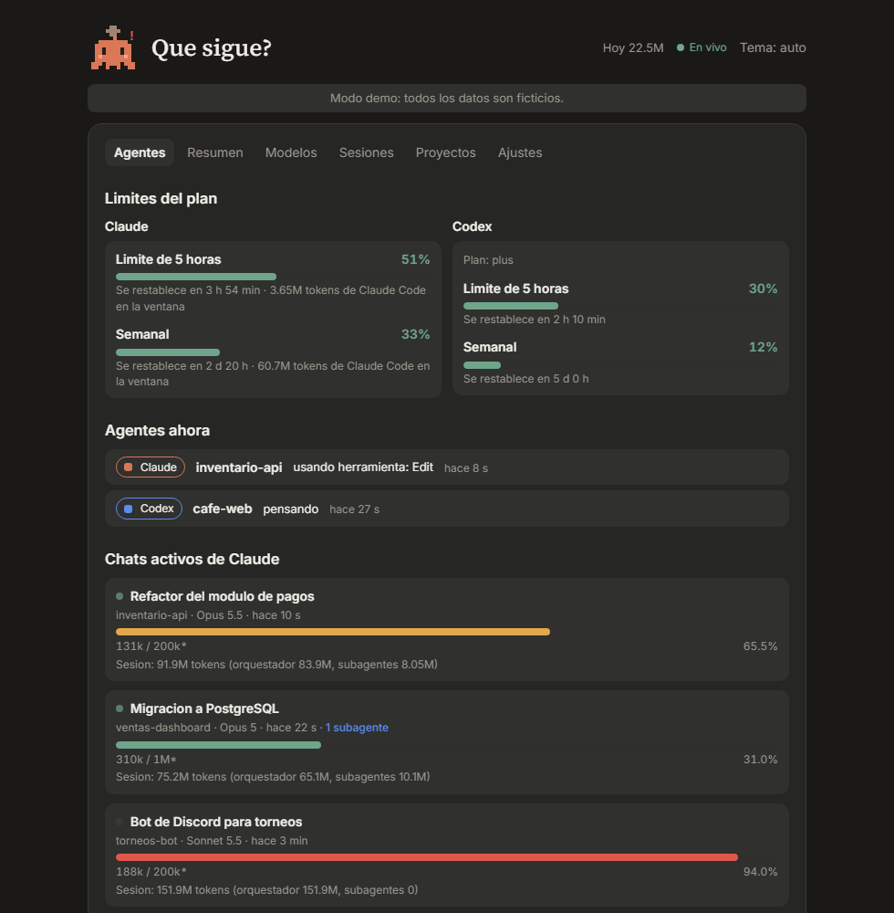
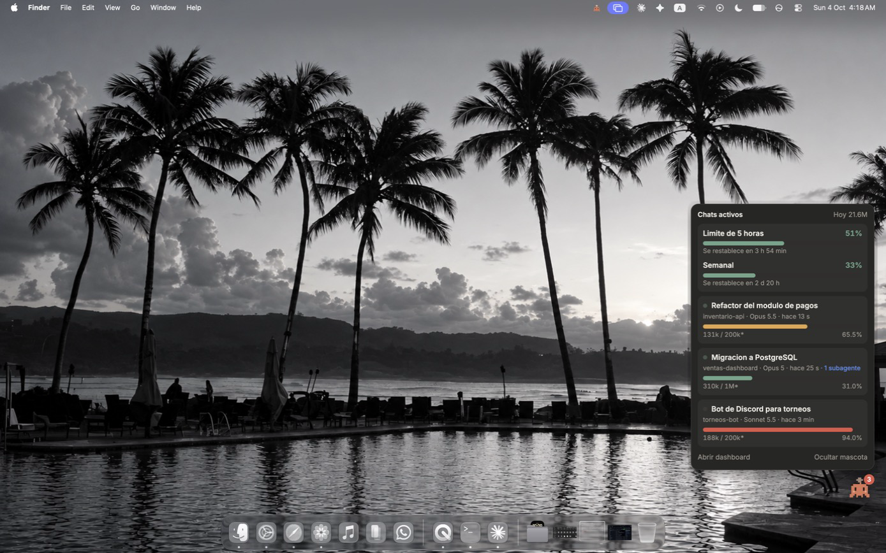
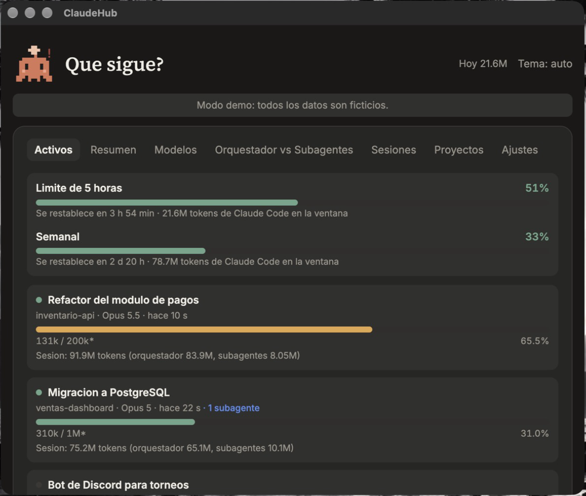

<div align="center">


# ClaudeHub

**See where your Claude Code tokens go.**
A local monitor for Windows, macOS, and Linux: web dashboard, floating mascot on desktop, and context alerts.

[Español](README.md) · **English** · [Português](README.pt-BR.md)

[](https://github.com/NormanSMA/ClaudeHub/actions/workflows/ci.yml)
[](https://github.com/NormanSMA/ClaudeHub/releases/latest)


<br />


<sub>Demo mode screenshots: all data is fictional.</sub>

</div>

---

## Contents

- [What is it](#what-is-it)
- [Try it in 1 minute](#try-it-in-1-minute)
- [Features](#features)
- [The mascot](#the-mascot)
- [Installation](#installation)
- [Install with an AI](#install-with-an-ai)
- [Usage](#usage)
- [Real context limit](#real-context-limit)
- [Your plan limits](#your-plan-limits-5-hour-and-weekly)
- [Other sources: Codex, Gemini, and OmniRoute](#other-sources-codex-gemini-and-omniroute)
- [Hook states](#hook-states)
- [Live updates](#live-updates)
- [How it works](#how-it-works)
- [Configuration](#configuration)
- [Local API](#local-api)
- [Privacy and security](#privacy-and-security)
- [Project structure](#project-structure)
- [Contribute](#contribute)
- [Roadmap](#roadmap)
- [License](#license)

## What is it

ClaudeHub reads the logs Claude Code saves on your PC and turns them into clear answers:

- How many tokens you spend and on which model.
- Which chats consume the most, with their title.
- How much the **orchestrator** uses and how much the **subagents** use.
- How full the **context window** of each active chat is.
- How much **Codex**, **Gemini CLI**, and **OmniRoute** spend too, with a filter by source.
- Which agents are working now, which wait for a permission, and whether two step on the same folder.

Everything runs on your machine. No data leaves it.

## Try it in 1 minute

Demo mode reads no files or settings. It uses fictional data, with three active chats in green, amber, and red.

```bash
pnpm install
pnpm build
pnpm demo
```

Open `http://127.0.0.1:4318`.

## Features

| | |
|---|---|
| **Agents** | Start tab. Lists Claude chats with recent activity (title, project, model, active subagents, and a context bar that goes from green to amber to red), the Claude and Codex limits, and live agents with their state, stalls, and clashes. |
| **Summary** | Sessions, messages, total tokens, active days, peak hour, favorite model, daily heatmap, and cache hit percentage. Includes **Orchestrator vs Subagents**: token distribution between both roles, daily evolution, and ranking of subagent types. |
| **Models** | Stacked bars by day, with input and output by model. Sorts by tokens, input, output, or name. |
| **Sessions and Projects** | Sortable tables by any column, with search by title and filter by project. |
| **Sources** | Selector All, Claude, Codex, Gemini, or OmniRoute for Summary, Models, Sessions, and Projects. Each source shows whether it could be read. |
| **Live** | The dashboard refreshes by itself when files change, without waiting for polling. |
| **Settings** | Edit your name, alert threshold, active minutes, and context window per model, without touching files. |
| **Date filters** | All, 30 days, 7 days, or a custom From and To range. |
| **Floating mascot** | A pixel character always visible. Drags, remembers its position, and opens the active chats panel when touched. |
| **Plan limits** | Your 5-hour limit and weekly limit as a percentage, showing how much time is left to reset, for Claude (Pro and Max plans) and for Codex. |
| **Hook states** | An optional hook records whether each agent is thinking, using a tool, waiting for a permission, or failed. It feeds the **Agents** tab and the mascot. |
| **`/uso` command** | Saves the Claude limits from the desktop app, where the status line does not run. |
| **Alerts** | System notification when a chat or your 5-hour limit exceeds the threshold (85% by default). |
| **System tray** | Icon with today's tokens in the tooltip and menu to open the dashboard. |
| **Status line** | Optional script that shows `ctx 43% | 5h 51%` in Claude Code and gives ClaudeHub the real window size and your plan limits. |
| **Auto-start** | Starts with the system and, if you want, when you start any Claude Code session. |
| **Theme** | Dark, light, or automatic, with Claude's terracotta palette. |
| **View links** | The tab stays in the URL (`#/models`), so you can link to it. |

<table>
  <tr>
    <td></td>
    <td></td>
  </tr>
  <tr>
    <td align="center"><sub>Summary and heatmap</sub></td>
    <td align="center"><sub>Tokens per model and per day</sub></td>
  </tr>
  <tr>
    <td></td>
    <td></td>
  </tr>
  <tr>
    <td align="center"><sub>Summary with Orchestrator vs Subagents</sub></td>
    <td align="center"><sub>Sessions with title, sorting, and filters</sub></td>
  </tr>
  <tr>
    <td></td>
    <td></td>
  </tr>
  <tr>
    <td align="center"><sub>Settings inside the dashboard</sub></td>
    <td align="center"><sub>Agents, limits per source and active chats</sub></td>
  </tr>
</table>

## The mascot

**Chispa** is an original character, drawn on a 14 x 12 pixel grid. It changes state based on what happens in your chats.

With the [state hook](#hook-states) installed, Chispa has 7 states. If several apply, the first one in this table wins:

<table>
  <tr>
    <td valign="top">

| State | When it appears |
|---|---|
| Waiting | An agent waits for you to approve a permission. |
| Error | A tool or an agent response failed. |
| Alert | Two active agents in the same folder, a stalled agent, or a limit above the threshold. |
| Tool | An agent runs a tool. |
| Thinking | An agent thinks or starts a session. |
| Happy | An agent finished less than 10 seconds ago. |
| Sleeping | Nothing to show. |

An agent counts as stalled after 5 minutes thinking or 15 minutes in a tool. Two agents clash if they work 10 seconds or more in the same folder.

Without the hook the simple rule applies: sleeping (no active chats), awake (chats exist, none is writing), working (a chat wrote in the last minute), and alert (a chat or your 5-hour limit exceeded the threshold).

If a Codex agent is working (according to the hook), Chispa shows a Codex badge. It is not a second mascot.

Touch it to open the active chats panel. If you open the dashboard from there, the mascot hides and comes back when you close it.

</td>
    <td></td>
  </tr>
</table>

## Installation

### Platforms

| System | Dashboard, demo, and API | Tray, mascot, and alerts |
|---|---|---|
| Windows 11 | Tested | Tested (daily use) |
| macOS | Tested in CI and by hand | Tested in CI and by hand (macOS 27, Apple Silicon) |
| Linux | Tested in CI and in Docker | Tested in CI and in Docker with a virtual display |

Tested by hand on macOS 27 (Apple Silicon, Node 26, Electron 44): tray, mascot with its panel, and dashboard open and work. Screenshots from demo mode:

<p align="center"> </p>

The macOS and Linux tests are automatic: CI starts the full application, opens the dashboard, checks that the mascot and the dashboard are visible, and closes through **Quit**. They do not replace a manual test on your desktop. On Linux the tray icon depends on the desktop (GNOME needs the AppIndicator extension) and notifications need a notification service.

The `.exe` installer is Windows only. On macOS and Linux, use it from the source code (`pnpm tray`).

### Option A: Windows installer

Download `ClaudeHub-Setup-x.y.z.exe` from [Releases](https://github.com/NormanSMA/ClaudeHub/releases/latest) and open it. You don't need Node or pnpm.

> The installer is not yet code-signed. Windows SmartScreen may warn: click **More info** and then **Run anyway**.

It installs only for your user, without asking for admin permission. To uninstall, use **Settings > Apps**.

### Option B: from source

Requirements:

- [Node.js](https://nodejs.org) 24 or higher.
- [pnpm](https://pnpm.io) 11.
- Claude Code installed and with history in `~/.claude/projects`.

```bash
git clone https://github.com/NormanSMA/ClaudeHub.git
cd ClaudeHub
pnpm install
pnpm build
```

To generate your own installer: `pnpm dist`. The result goes in `release/`.

## Install with an AI

Copy this text and paste it into Claude Code, or any AI agent with access to your terminal.

````text
Install and run ClaudeHub, a local monitor for Claude Code tokens.
Repository: https://github.com/NormanSMA/ClaudeHub

1. Clone it in a folder you prefer and enter it.
2. Check Node 24 or higher and pnpm 11 with `node -v` and `pnpm -v`. If either is missing, tell me how to install it.
3. Run `pnpm install` and `pnpm build`.
4. Run `pnpm test` and confirm they pass.
5. Try demo mode with `pnpm demo` and open http://127.0.0.1:4318. It uses fictional data. When done, stop the process.
6. Run `pnpm start` and check that http://127.0.0.1:4317/api/summary?range=7d returns JSON with my tokens.
7. Run `pnpm tray` to open the tray and floating mascot.
8. Ask me before editing ~/.claude/settings.json. If I agree, add the SessionStart hook and the status line from the "Open on Claude Code startup" and "Real context limit" sections of the README, with the real project paths, without removing my current settings.
9. When done, tell me my tokens from the last 7 days and what chats are active, using /api/summary and /api/active.

See AGENTS.md in the repository for more details.
````

The [`AGENTS.md`](AGENTS.md) file explains to an agent how to install, run, and query the API.

## Usage

### Dashboard only

```bash
pnpm start
```

Open `http://127.0.0.1:4317`.

### Tray and mascot

```bash
pnpm tray
```

Starts the tray, mascot, and local server if it's not running. The first time activates start with system. You can change it in the tray icon menu.

With the installer, open **ClaudeHub** from the Start menu.

### Open on Claude Code startup

ClaudeHub can be launched with just a `SessionStart` hook in `~/.claude/settings.json`.

From source:

```json
{
  "hooks": {
    "SessionStart": [
      {
        "hooks": [
          { "type": "command", "command": "node \"C:\\path\\to\\ClaudeHub\\scripts\\launch.cjs\"" }
        ]
      }
    ]
  }
}
```

On macOS and Linux the path uses regular slashes, for example `node "/home/ada/ClaudeHub/scripts/launch.cjs"`.

With the Windows installer, point to the executable:

```json
{ "type": "command", "command": "\"C:\\Users\\<your-user>\\AppData\\Local\\Programs\\ClaudeHub\\ClaudeHub.exe\" --background" }
```

The launcher outputs nothing, because a `SessionStart` hook's output is added to Claude's context. If the tray is already running, it does nothing.

### Tray menu

- **Open dashboard**: 780 x 660 window.
- **Open in browser**: the same interface in your browser.
- **Show mascot**: show or hide Chispa.
- **Start with system**: enable or disable auto-start.
- **Quit**.

### Scripts

| Command | What it does |
|---|---|
| `pnpm demo` | Server with fictional data at `http://127.0.0.1:4318`. |
| `pnpm start` | Server with your data at `http://127.0.0.1:4317`. |
| `pnpm tray` | Opens the tray and mascot with Electron. |
| `pnpm dev` | Server with reload and Vite at `http://127.0.0.1:5173`. |
| `pnpm build` | Compiles the interface to `dist/`. |
| `pnpm build:server` | Bundles the server to `dist-server/server.cjs`. |
| `pnpm dist` | Generates the Windows installer in `release/`. |
| `pnpm scan` | Prints a summary to the terminal, no interface. |
| `pnpm test` | Runs tests with Vitest. |

## Real context limit

Claude Code logs don't say what the context window is for each model. By default ClaudeHub **estimates** it (the numbers have an asterisk).

To use the **real** value, enable ClaudeHub's status line. Claude Code passes that script the window size of each session, and ClaudeHub saves and uses it.

Add this to `~/.claude/settings.json`:

```json
{
  "statusLine": {
    "type": "command",
    "command": "node \"C:\\path\\to\\ClaudeHub\\scripts\\statusline.cjs\""
  }
}
```

Besides saving the size, the script shows in Claude Code's status bar a line like:

```
[Opus] ctx 43% (430k/1.0M) | 5h 51% | 7d 33%
```

The color changes to yellow from 60% and to red from 85%.

Limit priority order:

1. Real size logged by the status line.
2. Value set in the **Settings** tab (or in `config.json`).
3. Estimate: up to 200,000 tokens assumes a 200,000 window; if the chat already exceeded it, 1,000,000.

If you already have your own status line, ask your script to call `statusline.cjs` passing the same JSON on stdin.

## Your plan limits (5-hour and weekly)

With the status line enabled, ClaudeHub shows your usage limits, the same ones you see in **Plan Usage Limits** in Claude:

- **5-hour limit:** percentage used and how much time is left to reset.
- **Weekly:** the same for the 7-day window.
- **Tokens in window:** how many Claude Code tokens from this machine fit within each window.

They appear in the **Agents** tab and in the mascot panel. If your 5-hour limit exceeds the alert threshold, the mascot alerts and the system notifies you once per window.

Things to know:

- Claude Code only sends this data to **Pro and Max** subscribers, and only after the session's first response.
- Anthropic calculates the percentage and includes all your plan usage, including web and apps too. ClaudeHub's tokens only count Claude Code on this machine, so the totals don't match.
- The data updates each time Claude Code runs the status line, for example when you send a message. If more than 15 minutes pass without activity, ClaudeHub notifies you. An expired window hides.
- Without the status line or the `/uso` command, ClaudeHub cannot read these limits: they don't appear in the logs.
- **The Claude desktop app does not run the status line**: it is a terminal feature. If you use Claude Code only from the desktop app, use the `/uso` command (next section). You can also use `claude` in a terminal with your account logged in (`/login`). The percentage covers your whole account, so one message from the terminal refreshes the data, which then stays fixed until the next terminal message.

### Limits from the desktop app: the `/uso` command

The `/uso` command calls Claude Code's `get_usage` tool and saves both windows to `rate-limits.json` with `scripts/write-limits.cjs`. The script validates the percentages (0 to 100) and the reset dates before writing.

Install it once:

1. Copy `scripts/commands/uso.md` to `~/.claude/commands/uso.md`.
2. Replace `<ruta-de-ClaudeHub>` with the folder where you cloned the project.

Run `/uso` in a Claude Code session. It shows the percentage and reset time of each window. If `get_usage` does not return a window, the command omits it and keeps the saved one while it has not expired.

The data updates only when you run `/uso`. No hook can call `get_usage`.

## Other sources: Codex, Gemini, and OmniRoute

Besides Claude Code, ClaudeHub reads usage from three sources. The `/api/sources` route tells whether each one could be read.

| Source | Where it reads | What it reads |
|---|---|---|
| Codex | `~/.codex/sessions/YYYY/MM/DD/rollout-*.jsonl` | Tokens per session (the increase of the running total), model, working folder, and plan limits (`rate_limits`). |
| Gemini CLI | `~/.gemini/tmp/<project>/chats/session-*.jsonl` | Tokens per Gemini message (no repeats, by `id`) and model. The project comes from the folder name. |
| OmniRoute | The `usage_history` table of its `storage.sqlite` database | Provider, model, and tokens (input, output, cache, reasoning) per call. |

Only usage fields are read. The text of conversations, thoughts, and instructions is never read or saved.

### Codex and Gemini

They are on by default. If you don't have the folder, the source stays empty without error. You can turn them off with `sources.codex` and `sources.gemini` in `config.json`.

Codex limits come from the most recent `rate_limits` in its 5 most recently modified rollouts. They are valid while the window has not expired: a window whose reset has passed is hidden. They only update when you use Codex.

### OmniRoute

OmniRoute runs in a Docker container and its usage API requires a panel session, so ClaudeHub reads its database read-only:

1. Every 60 seconds it runs `docker cp` (without a shell) to copy `storage.sqlite`, and `-wal` and `-shm` if they exist, from the container to `omniroute/` inside the data folder.
2. It opens the copy with `node:sqlite` read-only, validates it with `PRAGMA quick_check`, and reads only the `usage_history` table.
3. If the copy comes out damaged, it retries. If it fails, it keeps the previous reading and marks the source as stale.

It is off by default. Turn it on with `sources.omniroute: true`. Without Docker or without the container, the source shows an error and the rest keeps working.

If you mount the database on your disk, set `omniroute.dbPath` to the path of `storage.sqlite` and ClaudeHub opens it directly, without `docker cp`.

## Hook states

The `scripts/hook.cjs` script records each agent event in `events.jsonl` (data folder). It is optional. Without it, the **Agents** tab and the mascot use the simple rule.

Each line has this format and is 512 bytes at most:

```json
{"v":1,"ts":1760000000000,"source":"claude","session":"<id>","event":"PreToolUse","state":"tool","tool":"Edit","cwd":"<folder>"}
```

| Event | State |
|---|---|
| `SessionStart` | starting |
| `UserPromptSubmit`, `PostToolUse`, `PermissionDenied` | thinking |
| `PreToolUse` | tool |
| `PermissionRequest` | waiting |
| `PostToolUseFailure`, `StopFailure` | error |
| `Stop` | done |
| `SessionEnd` | idle |

Script guarantees:

- It always exits with code 0 and writes nothing to standard output or standard error. An output or code 2 could block the agent.
- It finishes in under 1 second, even if the input arrives empty or broken.
- It does not save the prompt, `tool_input`, or tool output. Only the event, the tool name, and the folder.
- It rotates `events.jsonl` to `events.1.jsonl` past 256 KB.

### Install the hook

Ask for confirmation before editing `~/.claude/settings.json`. Keep the hooks that already exist, including the launcher's `SessionStart`: add a new block to each list.

```json
{
  "hooks": {
    "UserPromptSubmit": [
      { "hooks": [ { "type": "command", "command": "node \"C:\\path\\to\\ClaudeHub\\scripts\\hook.cjs\" claude" } ] }
    ],
    "PreToolUse": [
      { "hooks": [ { "type": "command", "command": "node \"C:\\path\\to\\ClaudeHub\\scripts\\hook.cjs\" claude" } ] }
    ]
  }
}
```

Repeat the same block for the other events in the table. For Codex use the `codex` argument instead of `claude`, on the events your Codex version supports in its hooks configuration.

## Live updates

The server watches `~/.claude/projects`, `~/.codex/sessions`, `~/.gemini/tmp`, and the data folder. It groups changes into 500 ms bursts and notifies the dashboard and the mascot through `/api/events`. Only `.jsonl`, `.json`, and `.sqlite` files count. Folders that don't exist are retried every 60 seconds.

The interface keeps a fallback polling. With the live channel open, polling goes to a cycle of 60 seconds at least. If the channel fails, it returns to the normal cycle.

### Limit reached notice

This does not need the status line. When you reach a limit, Claude Code writes it to the logs with the exact reset time. ClaudeHub reads it and shows a red notice, for example **5-hour limit reached. Resets in 1 h 12 min**, plus a system notification and the mascot in alert mode. It also works with the desktop app.

## How it works

```
~/.claude/projects/<project>/<session>.jsonl                     orchestrator
~/.claude/projects/<project>/<session>/subagents/agent-*.jsonl   subagents
~/.codex/sessions, ~/.gemini/tmp, OmniRoute (optional)            other sources
<data>/events.jsonl                                               state hook
                     |
                     v
            src/core  (parser + aggregation)
                     |
                     v
        src/server  (local API on 127.0.0.1:4317)
            |                        |
            v                        v
     src/web (React)          src/tray (Electron)
   dashboard and mascot       tray, window, and alerts
```

### What is read from each log

Only usage fields: model, tokens (input, cache write and read, output), date, working folder, session, chat title, and last prompt to name it if it has no title. Responses are not saved or displayed.

From Codex, Gemini, and OmniRoute only usage fields are read (see [Other sources](#other-sources-codex-gemini-and-omniroute)). From the hook, the event, state, tool, and folder are saved, never the user's text.

### Counting rules

- **Total tokens** = input + cache write + cache read + output.
- **Deduplication by `message.id`.** Logs repeat the same message across multiple lines, one per content block. ClaudeHub counts each message once. In a test file, 569 of 1,383 lines were repeated.
- **Orchestrator or subagent.** A message is a subagent if it's in a `subagents/` folder or has `isSidechain: true`. The type comes from each agent's `.meta.json` file.
- **Projects.** Git worktrees (`--claude-worktrees-*`) are grouped under their base project. Works with Windows, macOS, and Linux paths.
- **Days and hours** use the local time zone.

### Context window

The context in use of a chat is the input of the orchestrator's last message: `input + cache write + cache read`. The limit comes from [Real context limit](#real-context-limit).

### Performance

- Reading is **incremental**: saves how many bytes it read from each file and processes only what's new.
- Large files are read in 8 MB chunks, not loaded fully into memory.
- An in-memory index avoids recalculating if no file changed.
- Reports that span more than one screen are calculated once per cycle.
- Hidden windows stop querying data.
- The server runs in a separate process, so it doesn't slow down the mascot.
- Measured on a laptop with Windows 11: the tray uses between 300 and 450 MB of RAM and about 0% CPU at rest.

## Configuration

The easiest way is the **Settings** tab of the dashboard. You can also edit the `config.json` file by hand. All fields are optional and reread every 10 seconds.

```json
{
  "name": "Ada",
  "contextLimits": { "Opus 5": 1000000, "Sonnet 5.5": 200000 },
  "activeMinutes": 20,
  "alertAt": 0.85,
  "sources": { "codex": true, "gemini": true, "omniroute": false },
  "omniroute": { "container": "omniroute", "dbPath": "" }
}
```

| Field | Default | Description |
|---|---|---|
| `name` | empty | Name for the interface greeting. No name means the greeting doesn't include it. |
| `contextLimits` | `{}` | Context limit per model name. Overrides the estimate. |
| `activeMinutes` | `20` | Minutes without activity before a chat stops being shown as active. |
| `alertAt` | `0.85` | Fraction of context that triggers the alert (between 0.5 and 0.99). |
| `sources.codex` | `true` | Reads Codex usage and limits. |
| `sources.gemini` | `true` | Reads Gemini CLI usage. |
| `sources.omniroute` | `false` | Reads OmniRoute usage. |
| `omniroute.container` | `omniroute` | Docker container name. Letters, numbers, dot, hyphen, and underscore only (up to 64). |
| `omniroute.dbPath` | empty | Path to `storage.sqlite`. With a value, it opens directly and `docker cp` is not used. |

### Where it's saved

| System | Data folder |
|---|---|
| Windows | `%APPDATA%\ClaudeHub\` |
| macOS | `~/Library/Application Support/ClaudeHub/` |
| Linux | `~/.config/ClaudeHub/` |

### Environment variables

| Variable | Description |
|---|---|
| `PORT` | Server port. Default `4317` (`4318` in demo mode). |
| `CLAUDEHUB_DEMO` | With value `1`, use fictional data. `pnpm demo` already sets it. |
| `CLAUDEHUB_DATA` | Replace the data folder. |
| `CLAUDE_PROJECTS_DIR` | Logs folder. Default `~/.claude/projects`. |
| `CODEX_SESSIONS_DIR` | Codex sessions folder. Default `~/.codex/sessions`. |
| `GEMINI_TMP_DIR` | Gemini CLI chats folder. Default `~/.gemini/tmp`. |
| `CLAUDEHUB_CACHE` | Path to the disk cache. |
| `CLAUDEHUB_CONFIG` | Path to the config file. |
| `CLAUDEHUB_WINDOWS` | Path to the real context windows file. |
| `CLAUDEHUB_PLAN` | Path to the plan limits file. |

### Files it creates

| File | Use |
|---|---|
| `cache.json` | Read cache, usage data only. Regenerates if you delete it. |
| `config.json` | Your configuration. Created when you save in Settings. |
| `context-windows.json` | Real context windows, if you enable the status line. |
| `rate-limits.json` | Claude plan limits (5-hour and weekly), if you enable the status line or run `/uso`. |
| `events.jsonl` and `events.1.jsonl` | State hook events. Rotates past 256 KB. |
| `omniroute/` | Temporary copy of the OmniRoute database, if you enable that source. |
| `overlay-pos.json` | Mascot's last position. |
| `setup.json` | Mark that auto-start was configured. |
| `tray.pid` | Running tray's process ID. |
| `electron/` | Electron's internal data. |

## Local API

Only responds on `127.0.0.1`. Rejects with `403` any request whose `Host` is not `127.0.0.1` or `localhost`, which prevents DNS rebinding attacks.

| Route | Returns |
|---|---|
| `GET /api/summary` | Totals, active days, peak hour, favorite model, and heatmap. |
| `GET /api/models` | Daily series by model and model table. |
| `GET /api/roles` | Orchestrator vs subagents and agent types. Claude only. |
| `GET /api/sessions` | Chats with title, project, dates, and tokens. |
| `GET /api/projects` | Tokens per project. |
| `GET /api/sources` | Per source: whether it is on, how many files and records it read, and whether it could be read. |
| `GET /api/live` | Last activity and today's tokens. |
| `GET /api/active` | Active Claude chats with context use and limit origin. Also: `plan` (Claude limits), `plans` (`claude` and `codex`), `agents`, `collisions`, and `mascot`. |
| `GET /api/events` | Live notices over SSE. Carries no usage data. |
| `GET /api/config` | Greeting name and whether demo mode is on. |
| `GET /api/settings` | Current configuration, its path, and seen models. |
| `PUT /api/settings` | Validates and saves the configuration. Requires `application/json`. |

Routes with range accept `?range=all|30d|7d` or `?from=YYYY-MM-DD&to=YYYY-MM-DD`. Dates are local and both ends are included.

`summary`, `models`, `sessions`, and `projects` also accept `?source=all|claude|codex|gemini|omniroute`. An unknown value is the same as `all`.

```bash
curl "http://127.0.0.1:4317/api/summary?from=2026-09-20&to=2026-09-30"
curl "http://127.0.0.1:4317/api/models?range=7d&source=codex"
```

### New fields in `/api/active`

| Field | Content |
|---|---|
| `plans` | `{ claude, codex }`. Each has the shape of `plan`, or `null` without current data. |
| `agents` | One entry per session with a hook: `source`, `session` (8 characters), `project` (folder name only), `state`, `since`, `tool`, and `stuck`. |
| `collisions` | Folders with two agents active at once: `project`, `sessions`, and `since`. |
| `mascot` | Chispa's state: `waiting`, `error`, `alert`, `tool`, `thinking`, `happy`, or `sleeping`. |

`plan` stays the same for those who already consume it.

### `/api/events`

SSE stream with no usage data. It sends `hello` on connect, `changed` when the watched files change, and a heartbeat every 25 seconds. It accepts 8 clients at once: the ninth gets `429`. It adds no CORS headers and goes through the same `Host` filter.

## Privacy and security

- The server listens only on `127.0.0.1`.
- No telemetry or calls to external services. The only network request is loading Google Fonts in the interface.
- Only usage fields and chat titles are read. Responses are not saved, nor are texts from Codex, Gemini, or OmniRoute.
- The cache contains only data aggregated per message.
- The state hook does not save prompts or tool arguments, and always exits with code 0 and no output.
- `/api/events` sends no usage data, accepts 8 clients, and grants no CORS.
- OmniRoute is read with `docker cp` without a shell, with the container name validated, and the copy is opened read-only.
- Settings writes require JSON, own origin, small body, and validate and limit each value.
- The mascot window uses `contextIsolation` and `sandbox`, and only exposes four actions to the interface process.
- Demo mode never touches your logs or configuration.

To report a vulnerability, read [SECURITY.md](SECURITY.md).

## Project structure

```
ClaudeHub/
├─ .github/               CI, issue and pull request templates
├─ build/icon.png         app icon
├─ scripts/
│  ├─ commands/uso.md     /uso command for plan limits
│  ├─ hook.cjs            state hook (writes events.jsonl)
│  ├─ launch.cjs          launcher for the SessionStart hook
│  ├─ statusline.cjs      status line and real window logging
│  └─ write-limits.cjs    saves the plan limits that /uso uses
├─ src/
│  ├─ core/               parser, cache, aggregation, and configuration
│  │  ├─ parse.ts         incremental reading and deduplication
│  │  ├─ scan.ts          logs traversal and caching
│  │  ├─ sources/         Codex, Gemini, and OmniRoute
│  │  ├─ agents.ts        agent states, stalls, clashes, and mascot
│  │  ├─ overview.ts      extra fields of /api/active
│  │  ├─ aggregate.ts     reports, ranges, and context
│  │  ├─ demo.ts          fictional data for demo mode
│  │  ├─ config.ts        validated configuration
│  │  ├─ paths.ts         data folders per system
│  │  ├─ windows.ts       real context windows
│  │  ├─ plan.ts          plan limits (5-hour and weekly)
│  │  ├─ models.ts        "claude-opus-5-5" -> "Opus 5.5"
│  │  └─ cli.ts           terminal summary
│  ├─ server/             local API, static files, and live notices
│  │  ├─ index.ts         routes
│  │  └─ watch.ts         folder watching and SSE
│  ├─ tray/               Electron: tray, mascot, alerts
│  └─ web/                React: dashboard, settings, and mascot
├─ docs/                  logo and demo screenshots
├─ test/                  tests
├─ AGENTS.md              guide for AI agents
└─ LICENSE                MIT
```

## Contribute

Contributions are welcome. Read [CONTRIBUTING.md](CONTRIBUTING.md) and the [code of conduct](CODE_OF_CONDUCT.md).

```bash
npx tsc --noEmit && pnpm test && pnpm build
```

CI runs those three checks on Linux, Windows, and macOS.

## Roadmap

- Chrome extension that reads the local server.
- Public online demo with fictional data.
- Docker image with `~/.claude` mounted read-only.
- Installers for macOS (`.dmg`) and Linux (`.AppImage` and `.deb`).
- Code sign the Windows installer.

## Known limitations

- Tray and mascot are tested automatically on macOS and Linux, but only used daily on Windows 11. On Linux the tray icon depends on the desktop.
- Without the status line, the context limit is an estimate.
- The `/uso` command updates the Claude limits only when you run it. No hook can call `get_usage`.
- Codex limits are read from its rollouts and are valid while the window has not expired. They only update when you use Codex.
- OmniRoute needs Docker (or `omniroute.dbPath`) and Node with `node:sqlite`. The copy renews every 60 seconds.
- Hook states need the hook installed. Without it, the mascot uses the simple 4-state rule.
- The installer is not signed.
- Daylight saving time can shift the start of 7 and 30-day ranges by one hour in zones that use it.
- Depends on Claude Code's log format, which may change between versions.

## License

[MIT](LICENSE) © 2026 Norman Smith Martínez Acevedo.

Open source and public: use it, modify it, and share it.
