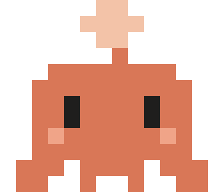
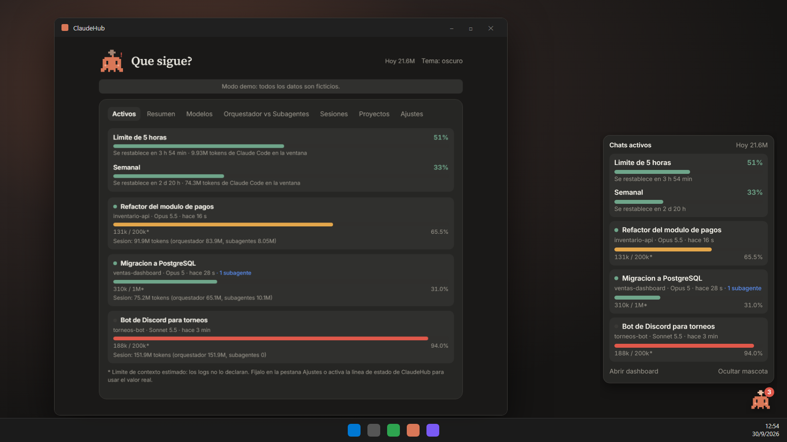
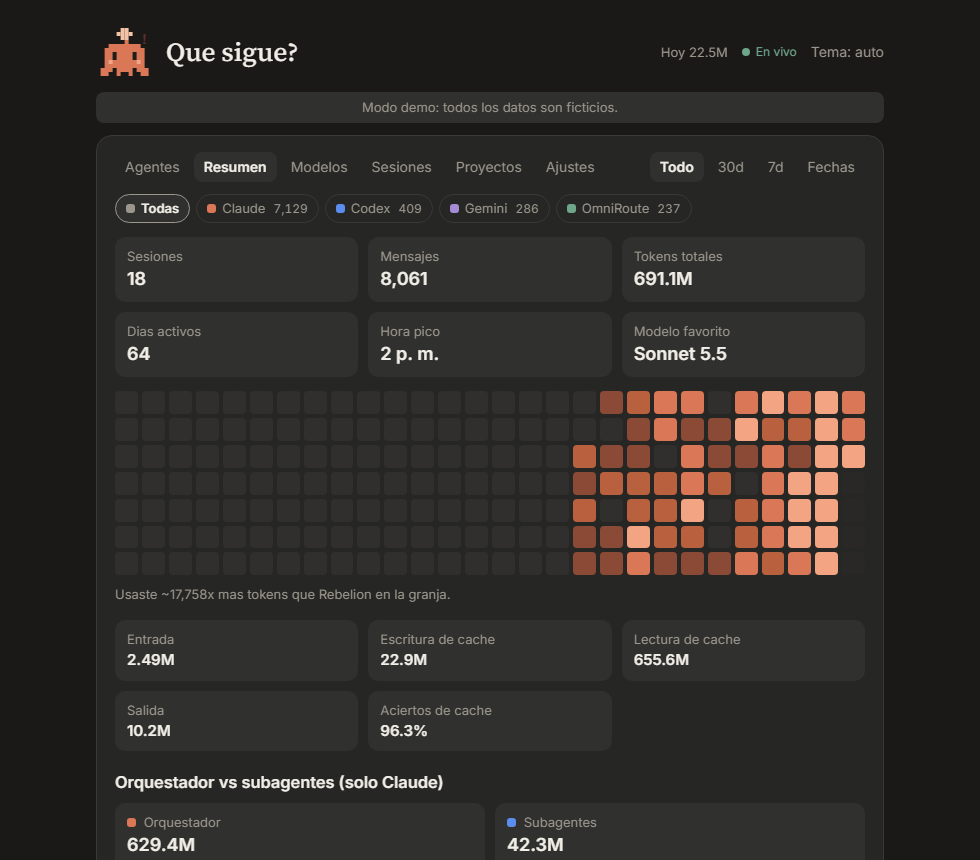
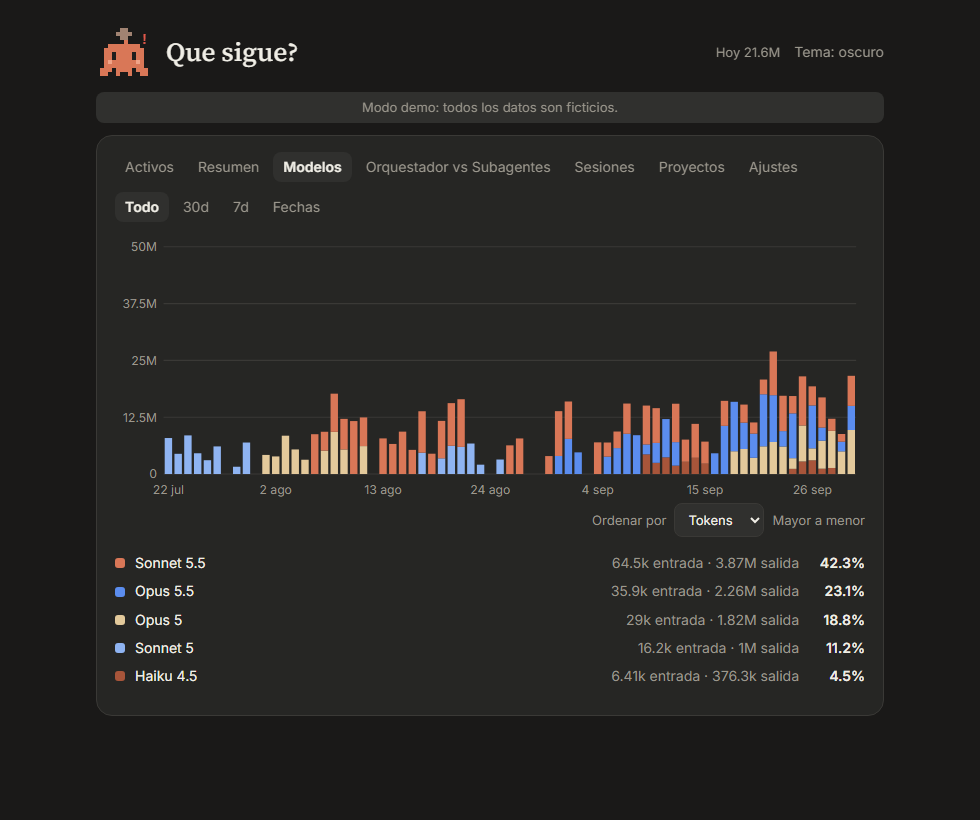
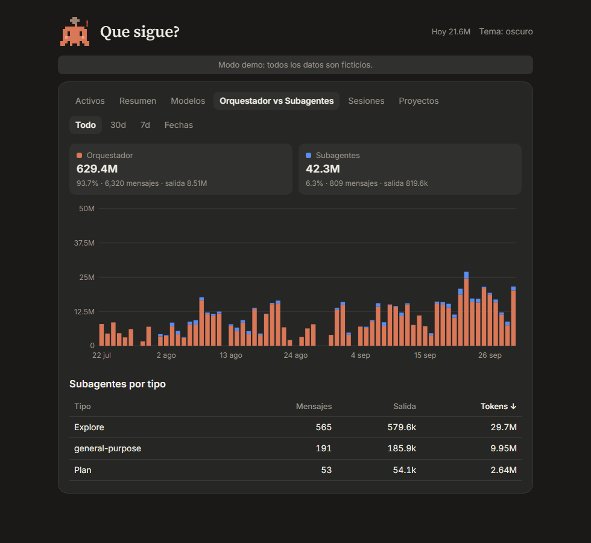
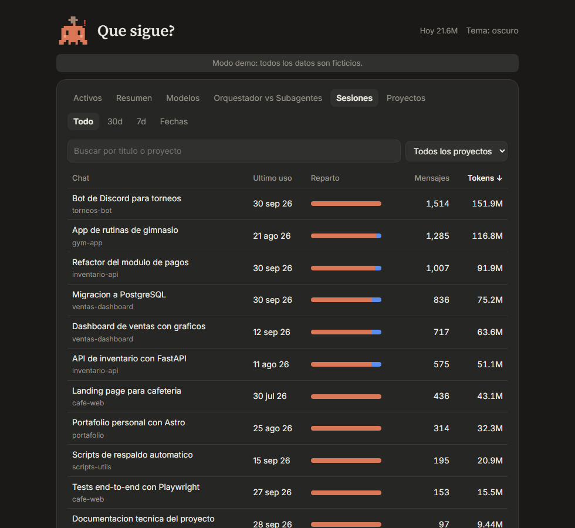
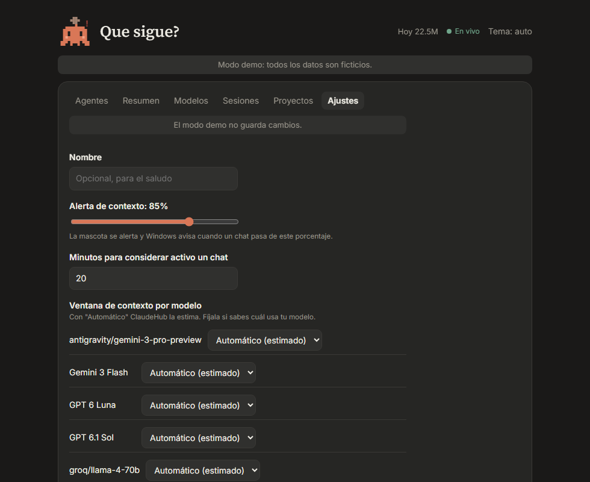
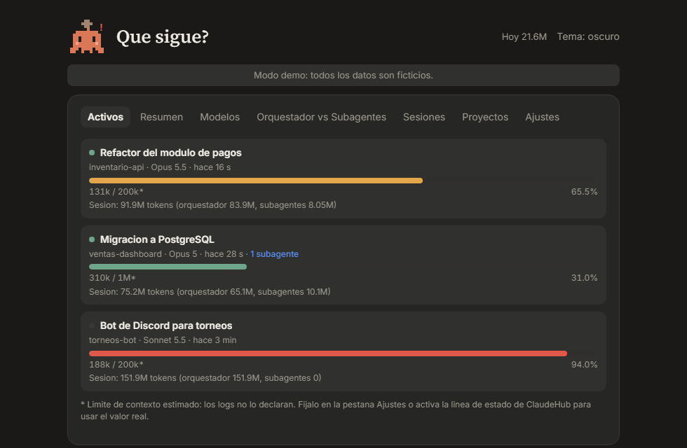
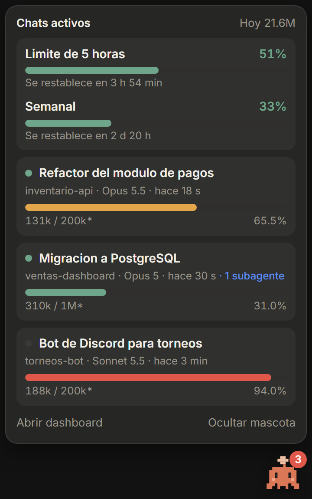

<div align="center">



# ClaudeHub

**Mira a dónde se van tus tokens de Claude Code.**
Un monitor local para Windows, macOS y Linux: dashboard web, mascota flotante en el escritorio y alertas de contexto.

**Español** · [English](README.en.md) · [Português](README.pt-BR.md)

[](https://github.com/NormanSMA/ClaudeHub/actions/workflows/ci.yml)
[](https://github.com/NormanSMA/ClaudeHub/releases/latest)


<br />



<sub>Capturas del modo demo: todos los datos son ficticios.</sub>

</div>

---

## Contenido

- [Qué es](#qué-es)
- [Pruébalo en 1 minuto](#pruébalo-en-1-minuto)
- [Características](#características)
- [La mascota](#la-mascota)
- [Instalación](#instalación)
- [Instalar con una IA](#instalar-con-una-ia)
- [Uso](#uso)
- [Límite de contexto real](#límite-de-contexto-real)
- [Límites de tu plan](#límites-de-tu-plan-5-horas-y-semanal)
- [Cómo funciona](#cómo-funciona)
- [Configuración](#configuración)
- [API local](#api-local)
- [Privacidad y seguridad](#privacidad-y-seguridad)
- [Estructura del proyecto](#estructura-del-proyecto)
- [Contribuir](#contribuir)
- [Hoja de ruta](#hoja-de-ruta)
- [Licencia](#licencia)

## Qué es

ClaudeHub lee los registros que Claude Code guarda en tu PC y los convierte en respuestas claras:

- Cuántos tokens gastas y en qué modelo.
- Qué chats consumen más, con su título.
- Cuánto usa el **orquestador** y cuánto usan los **subagentes**.
- Qué tan llena está la **ventana de contexto** de cada chat activo.

Todo corre en tu máquina. Ningún dato sale de ella.

## Pruébalo en 1 minuto

El modo demo no lee ningún archivo tuyo ni tu configuración. Usa datos ficticios, con tres chats activos en verde, ámbar y rojo.

```bash
pnpm install
pnpm build
pnpm demo
```

Abre `http://127.0.0.1:4318`.

## Características

| | |
|---|---|
| **Chats activos** | Lista los chats con actividad reciente. Muestra título, proyecto, modelo, subagentes activos y una barra de contexto que pasa de verde a ámbar y a rojo. |
| **Resumen** | Sesiones, mensajes, tokens totales, días activos, hora pico, modelo favorito, mapa de calor por día y porcentaje de aciertos de caché. |
| **Modelos** | Barras apiladas por día, con entrada y salida por modelo. Se ordena por tokens, entrada, salida o nombre. |
| **Orquestador vs Subagentes** | Reparto de tokens entre ambos roles, evolución diaria y ranking de tipos de subagente. |
| **Sesiones y Proyectos** | Tablas ordenables por cualquier columna, con búsqueda por título y filtro por proyecto. |
| **Ajustes** | Edita tu nombre, el umbral de alerta, los minutos de actividad y la ventana de contexto de cada modelo, sin tocar archivos. |
| **Filtros de fecha** | Todo, 30 días, 7 días o un rango Desde y Hasta. |
| **Mascota flotante** | Un personaje pixel siempre visible. Se arrastra, recuerda su posición y al tocarla abre el panel de chats activos. |
| **Límites del plan** | Tu límite de 5 horas y el semanal como porcentaje, con cuánto falta para que se restablezcan, junto a los chats activos (planes Pro y Max). |
| **Alertas** | Notificación del sistema cuando un chat o tu límite de 5 horas pasan del umbral (85% por defecto). |
| **Bandeja del sistema** | Icono con los tokens de hoy en el tooltip y menú para abrir el dashboard. |
| **Línea de estado** | Script opcional que muestra `ctx 43% | 5h 51%` en Claude Code y le da a ClaudeHub el tamaño real de la ventana y los límites de tu plan. |
| **Inicio automático** | Arranca con el sistema y, si quieres, al iniciar cualquier sesión de Claude Code. |
| **Tema** | Oscuro, claro o automático, con la paleta terracota de Claude. |
| **Enlaces a vistas** | La pestaña queda en la dirección (`#/modelos`), así que puedes enlazarla. |

<table>
  <tr>
    <td></td>
    <td></td>
  </tr>
  <tr>
    <td align="center"><sub>Resumen y mapa de calor</sub></td>
    <td align="center"><sub>Tokens por modelo y por día</sub></td>
  </tr>
  <tr>
    <td></td>
    <td></td>
  </tr>
  <tr>
    <td align="center"><sub>Orquestador vs Subagentes</sub></td>
    <td align="center"><sub>Sesiones con título, orden y filtros</sub></td>
  </tr>
  <tr>
    <td></td>
    <td></td>
  </tr>
  <tr>
    <td align="center"><sub>Ajustes dentro del dashboard</sub></td>
    <td align="center"><sub>Chats activos y su contexto</sub></td>
  </tr>
</table>

## La mascota

**Chispa** es un personaje original, dibujado en una cuadrícula de 14 x 12 píxeles. Cambia de estado según lo que pasa en tus chats.

<table>
  <tr>
    <td valign="top">

| Estado | Cuándo aparece |
|---|---|
| Durmiendo | No hay chats activos. |
| Despierta | Hay chats abiertos, pero ninguno escribe ahora. |
| Trabajando | Un chat escribió en el último minuto. |
| Alerta | Algún chat, o tu límite de 5 horas, superó el umbral. |

Al tocarla se abre el panel de chats activos. Si abres el dashboard desde ahí, la mascota se oculta y vuelve cuando lo cierras.

</td>
    <td></td>
  </tr>
</table>

## Instalación

### Plataformas

| Sistema | Dashboard, demo y API | Bandeja, mascota y alertas |
|---|---|---|
| Windows 11 | Probado | Probado (uso diario) |
| macOS | Probado en CI | Probado en CI (arranque, ventanas y salida) |
| Linux | Probado en CI y en Docker | Probado en CI y en Docker con pantalla virtual |

Las pruebas de macOS y Linux son automáticas: el CI arranca la aplicación completa, abre el dashboard, comprueba que la mascota y el dashboard se ven y cierra por **Salir**. No sustituyen una prueba a mano en tu escritorio. En Linux el icono de la bandeja depende del escritorio (GNOME necesita la extensión AppIndicator) y las notificaciones necesitan un servicio de notificaciones.

El instalador `.exe` es solo para Windows. En macOS y Linux se usa desde el código (`pnpm tray`).

### Opción A: instalador de Windows

Descarga `ClaudeHub-Setup-x.y.z.exe` desde [Releases](https://github.com/NormanSMA/ClaudeHub/releases/latest) y ábrelo. No necesitas Node ni pnpm.

> El instalador aún no tiene firma de código. Windows SmartScreen puede avisar: pulsa **Más información** y luego **Ejecutar de todos modos**.

Se instala solo para tu usuario, sin pedir permisos de administrador. Para desinstalarlo usa **Configuración > Aplicaciones**.

### Opción B: desde el código

Requisitos:

- [Node.js](https://nodejs.org) 24 o superior.
- [pnpm](https://pnpm.io) 11.
- Claude Code instalado y con historial en `~/.claude/projects`.

```bash
git clone https://github.com/NormanSMA/ClaudeHub.git
cd ClaudeHub
pnpm install
pnpm build
```

Para generar tu propio instalador: `pnpm dist`. El resultado queda en `release/`.

## Instalar con una IA

Copia este texto y pégalo en Claude Code, o en cualquier agente de IA con acceso a tu terminal.

````text
Instala y ejecuta ClaudeHub, un monitor local de tokens de Claude Code.
Repositorio: https://github.com/NormanSMA/ClaudeHub

1. Clónalo en la carpeta que prefieras y entra en ella.
2. Verifica Node 24 o superior y pnpm 11 con `node -v` y `pnpm -v`. Si falta alguno, dime cómo instalarlo.
3. Ejecuta `pnpm install` y `pnpm build`.
4. Ejecuta `pnpm test` y confirma que pasan.
5. Prueba el modo demo con `pnpm demo` y abre http://127.0.0.1:4318. Usa datos ficticios. Cuando termines, detén el proceso.
6. Ejecuta `pnpm start` y comprueba que http://127.0.0.1:4317/api/summary?range=7d devuelve JSON con mis tokens.
7. Ejecuta `pnpm tray` para abrir la bandeja y la mascota flotante.
8. Pregúntame antes de editar ~/.claude/settings.json. Si acepto, agrega el hook SessionStart y la línea de estado de las secciones "Abrir al iniciar Claude Code" y "Límite de contexto real" del README, con las rutas reales del proyecto, sin borrar mis ajustes actuales.
9. Al terminar, dime mis tokens de los últimos 7 días y qué chats están activos, usando /api/summary y /api/active.

Lee AGENTS.md del repositorio para más detalles.
````

El archivo [`AGENTS.md`](AGENTS.md) explica a un agente cómo instalarlo, ejecutarlo y consultar la API.

## Uso

### Solo el dashboard

```bash
pnpm start
```

Abre `http://127.0.0.1:4317`.

### Bandeja y mascota

```bash
pnpm tray
```

Inicia la bandeja, la mascota y el servidor local si no está activo. La primera vez activa el inicio con el sistema. Puedes cambiarlo en el menú del icono de la bandeja.

Con el instalador, abre **ClaudeHub** desde el menú Inicio.

### Abrir al iniciar Claude Code

ClaudeHub se puede lanzar solo con un hook `SessionStart` en `~/.claude/settings.json`.

Desde el código fuente:

```json
{
  "hooks": {
    "SessionStart": [
      {
        "hooks": [
          { "type": "command", "command": "node \"C:\\ruta\\a\\ClaudeHub\\scripts\\launch.cjs\"" }
        ]
      }
    ]
  }
}
```

En macOS y Linux la ruta lleva barras normales, por ejemplo `node "/home/ada/ClaudeHub/scripts/launch.cjs"`.

Con el instalador de Windows, apunta al ejecutable:

```json
{ "type": "command", "command": "\"C:\\Users\\<tu-usuario>\\AppData\\Local\\Programs\\ClaudeHub\\ClaudeHub.exe\" --background" }
```

El lanzador no imprime nada, porque la salida de un hook `SessionStart` se agrega al contexto de Claude. Si la bandeja ya corre, no hace nada.

### Menú de la bandeja

- **Abrir dashboard**: ventana de 780 x 660.
- **Abrir en el navegador**: la misma interfaz en tu navegador.
- **Mostrar mascota**: muestra u oculta a Chispa.
- **Iniciar con el sistema**: activa o desactiva el arranque automático.
- **Salir**.

### Scripts

| Comando | Qué hace |
|---|---|
| `pnpm demo` | Servidor con datos ficticios en `http://127.0.0.1:4318`. |
| `pnpm start` | Servidor con tus datos en `http://127.0.0.1:4317`. |
| `pnpm tray` | Abre la bandeja y la mascota con Electron. |
| `pnpm dev` | Servidor con recarga y Vite en `http://127.0.0.1:5173`. |
| `pnpm build` | Compila la interfaz en `dist/`. |
| `pnpm build:server` | Empaqueta el servidor en `dist-server/server.cjs`. |
| `pnpm dist` | Genera el instalador de Windows en `release/`. |
| `pnpm scan` | Imprime un resumen en la terminal, sin interfaz. |
| `pnpm test` | Ejecuta las pruebas con Vitest. |

## Límite de contexto real

Los registros de Claude Code no dicen cuál es la ventana de contexto de cada modelo. Por defecto ClaudeHub la **estima** (las cifras llevan un asterisco).

Para usar el valor **real**, activa la línea de estado de ClaudeHub. Claude Code le pasa a ese script el tamaño de la ventana de cada sesión, y ClaudeHub lo guarda y lo usa.

Agrega esto en `~/.claude/settings.json`:

```json
{
  "statusLine": {
    "type": "command",
    "command": "node \"C:\\ruta\\a\\ClaudeHub\\scripts\\statusline.cjs\""
  }
}
```

Además de guardar el tamaño, el script muestra en la barra de Claude Code una línea como:

```
[Opus] ctx 43% (430k/1.0M) | 5h 51% | 7d 33%
```

El color cambia a amarillo desde 60% y a rojo desde 85%.

Orden de prioridad del límite:

1. Tamaño real registrado por la línea de estado.
2. Valor fijado en la pestaña **Ajustes** (o en `config.json`).
3. Estimación: hasta 200 000 tokens se asume una ventana de 200 000; si el chat ya la superó, 1 000 000.

Si ya tienes una línea de estado propia, pídele a tu script que invoque a `statusline.cjs` pasándole el mismo JSON por entrada estándar.

## Límites de tu plan (5 horas y semanal)

Con la línea de estado activada, ClaudeHub muestra tus límites de uso, los mismos que ves en **Límites de uso del plan** de Claude:

- **Límite de 5 horas:** porcentaje usado y cuánto falta para que se restablezca.
- **Semanal:** lo mismo para la ventana de 7 días.
- **Tokens en la ventana:** cuántos tokens de Claude Code de este equipo caben dentro de cada ventana.

Aparecen arriba de la pestaña **Activos** y en el panel de la mascota. Si tu límite de 5 horas pasa del umbral de alerta, la mascota se alerta y el sistema te avisa, una vez por ventana.

Cosas que debes saber:

- Claude Code solo envía estos datos a suscriptores **Pro y Max**, y solo después de la primera respuesta de la sesión.
- El porcentaje lo calcula Anthropic e incluye todo tu uso del plan, también el de la web y las apps. Los tokens de ClaudeHub solo cuentan Claude Code en este equipo, así que no suman el mismo total.
- El dato se actualiza cada vez que Claude Code ejecuta la línea de estado, por ejemplo al enviar un mensaje. Si pasan más de 15 minutos sin actividad, ClaudeHub lo avisa. Una ventana vencida se oculta.
- Sin la línea de estado, ClaudeHub no puede leer estos límites: no salen en los registros.
- **La app de escritorio de Claude no ejecuta la línea de estado**: es una función de la terminal. Si usas Claude Code solo desde la app de escritorio, no verás los porcentajes; ClaudeHub no puede leerlos en otro sitio. Para verlos, usa `claude` en una terminal con tu sesión iniciada (`/login`). El porcentaje es de toda tu cuenta, así que un mensaje desde la terminal actualiza el dato, que queda fijo hasta el siguiente mensaje de terminal.

### Aviso de límite alcanzado

Esto no necesita la línea de estado. Cuando llegas a un límite, Claude Code lo anota en los registros con la hora exacta de reinicio. ClaudeHub lo lee y muestra un aviso rojo, por ejemplo **Límite de 5 horas alcanzado. Se restablece en 1 h 12 min**, además de una notificación del sistema y la mascota en alerta. Funciona también con la app de escritorio.

## Cómo funciona

```
~/.claude/projects/<proyecto>/<sesion>.jsonl                     orquestador
~/.claude/projects/<proyecto>/<sesion>/subagents/agent-*.jsonl   subagentes
                     |
                     v
            src/core  (parser + agregación)
                     |
                     v
        src/server  (API local en 127.0.0.1:4317)
            |                        |
            v                        v
     src/web (React)          src/tray (Electron)
   dashboard y mascota       bandeja, ventana y alertas
```

### Qué se lee de cada log

Solo campos de uso: modelo, tokens (entrada, escritura y lectura de caché, salida), fecha, carpeta de trabajo, sesión, título del chat y último prompt para nombrarlo si no tiene título. No se guardan ni se muestran las respuestas.

### Reglas de conteo

- **Total de tokens** = entrada + escritura de caché + lectura de caché + salida.
- **Deduplicación por `message.id`.** Los registros repiten un mismo mensaje en varias líneas, una por bloque de contenido. ClaudeHub cuenta cada mensaje una sola vez. En un archivo de prueba, 569 de 1383 líneas eran repetidas.
- **Orquestador o subagente.** Un mensaje es de subagente si está en una carpeta `subagents/` o trae `isSidechain: true`. El tipo sale del archivo `.meta.json` de cada agente.
- **Proyectos.** Los worktrees de Git (`--claude-worktrees-*`) se agrupan bajo su proyecto base. Funciona con rutas de Windows, macOS y Linux.
- **Días y horas** usan la zona horaria local.

### Ventana de contexto

El contexto en uso de un chat es la entrada del último mensaje del orquestador: `entrada + escritura de caché + lectura de caché`. El límite sale de [Límite de contexto real](#límite-de-contexto-real).

### Rendimiento

- La lectura es **incremental**: guarda cuántos bytes leyó de cada archivo y procesa solo lo nuevo.
- Los archivos grandes se leen por bloques de 8 MB, sin cargarlos completos en memoria.
- Un índice en memoria evita recalcular si ningún archivo cambió.
- Los reportes que pide más de una pantalla se calculan una vez por ciclo.
- Las ventanas ocultas dejan de consultar datos.
- El servidor corre en un proceso aparte, así que no frena la mascota.
- Medido en una laptop con Windows 11: la bandeja usa entre 300 y 450 MB de RAM y cerca de 0% de CPU en reposo.

## Configuración

Lo más fácil es la pestaña **Ajustes** del dashboard. También puedes editar el archivo `config.json` a mano. Todos los campos son opcionales y se releen cada 10 segundos.

```json
{
  "name": "Ada",
  "contextLimits": { "Opus 5": 1000000, "Sonnet 5.5": 200000 },
  "activeMinutes": 20,
  "alertAt": 0.85
}
```

| Campo | Por defecto | Descripción |
|---|---|---|
| `name` | vacío | Nombre para el saludo de la interfaz. Sin nombre, el saludo no lo incluye. |
| `contextLimits` | `{}` | Límite de contexto por nombre de modelo. Reemplaza la estimación. |
| `activeMinutes` | `20` | Minutos sin actividad antes de dejar de mostrar un chat como activo. |
| `alertAt` | `0.85` | Fracción de contexto que dispara la alerta (entre 0.5 y 0.99). |

### Dónde se guarda

| Sistema | Carpeta de datos |
|---|---|
| Windows | `%APPDATA%\ClaudeHub\` |
| macOS | `~/Library/Application Support/ClaudeHub/` |
| Linux | `~/.config/ClaudeHub/` |

### Variables de entorno

| Variable | Descripción |
|---|---|
| `PORT` | Puerto del servidor. Por defecto `4317` (`4318` en modo demo). |
| `CLAUDEHUB_DEMO` | Con valor `1`, usa datos ficticios. `pnpm demo` ya lo activa. |
| `CLAUDEHUB_DATA` | Reemplaza la carpeta de datos. |
| `CLAUDE_PROJECTS_DIR` | Carpeta de logs. Por defecto `~/.claude/projects`. |
| `CLAUDEHUB_CACHE` | Ruta del caché en disco. |
| `CLAUDEHUB_CONFIG` | Ruta del archivo de configuración. |
| `CLAUDEHUB_WINDOWS` | Ruta del archivo de ventanas reales de contexto. |
| `CLAUDEHUB_PLAN` | Ruta del archivo de límites del plan. |

### Archivos que crea

| Archivo | Uso |
|---|---|
| `cache.json` | Caché de lectura, solo con datos de uso. Se regenera si lo borras. |
| `config.json` | Tu configuración. Se crea al guardar en Ajustes. |
| `context-windows.json` | Ventanas de contexto reales, si activas la línea de estado. |
| `rate-limits.json` | Límites del plan (5 horas y semanal), si activas la línea de estado. |
| `overlay-pos.json` | Última posición de la mascota. |
| `setup.json` | Marca de que ya se configuró el inicio automático. |
| `tray.pid` | Identificador de la bandeja en ejecución. |
| `electron/` | Datos internos de Electron. |

## API local

Solo responde en `127.0.0.1`. Rechaza con `403` cualquier petición cuyo `Host` no sea `127.0.0.1` o `localhost`, lo que evita ataques de DNS rebinding.

| Ruta | Devuelve |
|---|---|
| `GET /api/summary` | Totales, días activos, hora pico, modelo favorito y mapa de calor. |
| `GET /api/models` | Serie diaria por modelo y tabla de modelos. |
| `GET /api/roles` | Orquestador contra subagentes y tipos de agente. |
| `GET /api/sessions` | Chats con título, proyecto, fechas y tokens. |
| `GET /api/projects` | Tokens por proyecto. |
| `GET /api/live` | Última actividad y tokens de hoy. |
| `GET /api/active` | Chats activos con su uso de contexto y el origen del límite, y los límites del plan (`plan`). |
| `GET /api/config` | Nombre del saludo y si está el modo demo. |
| `GET /api/settings` | Configuración actual, su ruta y los modelos vistos. |
| `PUT /api/settings` | Valida y guarda la configuración. Exige `application/json`. |

Las rutas con rango aceptan `?range=all|30d|7d` o `?from=AAAA-MM-DD&to=AAAA-MM-DD`. Las fechas son locales y ambos extremos se incluyen.

```bash
curl "http://127.0.0.1:4317/api/summary?from=2026-09-20&to=2026-09-30"
```

## Privacidad y seguridad

- El servidor escucha solo en `127.0.0.1`.
- No hay telemetría ni llamadas a servicios externos. La única petición de red es la carga de las fuentes de Google Fonts en la interfaz.
- Se leen solo campos de uso y títulos de chats. No se guardan respuestas.
- El caché contiene únicamente datos agregados por mensaje.
- La escritura de ajustes exige JSON, un origen propio y un cuerpo pequeño, y valida y acota cada valor.
- La ventana de la mascota usa `contextIsolation` y `sandbox`, y solo expone cuatro acciones al proceso de la interfaz.
- El modo demo nunca toca tus registros ni tu configuración.

Para reportar una vulnerabilidad, lee [SECURITY.md](SECURITY.md).

## Estructura del proyecto

```
ClaudeHub/
├─ .github/               CI, plantillas de issues y de pull requests
├─ build/icon.png         icono de la aplicación
├─ scripts/
│  ├─ launch.cjs          lanzador para el hook SessionStart
│  └─ statusline.cjs      línea de estado y registro de la ventana real
├─ src/
│  ├─ core/               parser, caché, agregación y configuración
│  │  ├─ parse.ts         lectura incremental y deduplicación
│  │  ├─ scan.ts          recorrido de logs y caché
│  │  ├─ aggregate.ts     reportes, rangos y contexto
│  │  ├─ demo.ts          datos ficticios para el modo demo
│  │  ├─ config.ts        configuración validada
│  │  ├─ paths.ts         carpetas de datos por sistema
│  │  ├─ windows.ts       ventanas de contexto reales
│  │  ├─ plan.ts          límites del plan (5 horas y semanal)
│  │  ├─ models.ts        "claude-opus-5-5" -> "Opus 5.5"
│  │  └─ cli.ts           resumen por terminal
│  ├─ server/index.ts     API local y archivos estáticos
│  ├─ tray/               Electron: bandeja, mascota, alertas
│  └─ web/                React: dashboard, ajustes y mascota
├─ docs/                  logo y capturas del modo demo
├─ test/                  pruebas
├─ AGENTS.md              guía para agentes de IA
└─ LICENSE                MIT
```

## Contribuir

Las contribuciones son bienvenidas. Lee [CONTRIBUTING.md](CONTRIBUTING.md) y el [código de conducta](CODE_OF_CONDUCT.md).

```bash
npx tsc --noEmit && pnpm test && pnpm build
```

El CI corre esas tres comprobaciones en Linux, Windows y macOS.

## Hoja de ruta

- Extensión de Chrome que lea el servidor local.
- Demo pública en línea con datos ficticios.
- Imagen de Docker con `~/.claude` montado en solo lectura.
- Instaladores para macOS (`.dmg`) y Linux (`.AppImage` y `.deb`).
- Firma de código del instalador de Windows.

## Limitaciones conocidas

- La bandeja y la mascota se prueban de forma automática en macOS y Linux, pero solo se usan a diario en Windows 11. En Linux el icono de la bandeja depende del escritorio.
- Sin la línea de estado, el límite de contexto es una estimación.
- El instalador no está firmado.
- El cambio de horario de verano puede desplazar una hora el inicio de los rangos de 7 y 30 días en zonas que lo usan.
- Depende del formato de los registros de Claude Code, que puede cambiar entre versiones.

## Licencia

[MIT](LICENSE) © 2026 Norman Smith Martínez Acevedo.

Código abierto y público: úsalo, modifícalo y compártelo.
